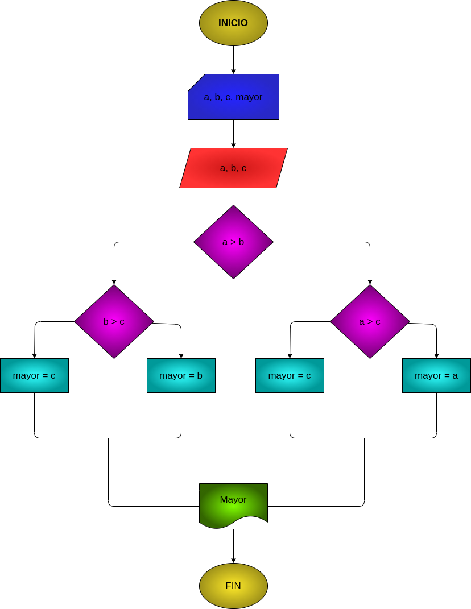

## EJERCICIO 2 ESTRUCTURAS CONDICIONALES

## Programa para hallar el mayor de tres numeros enteros

## ANALISIS

### Definicion de variables

* a: primer numero
* b: segundo numero
* c: tercer numero
* mayor: numero mayor

Se comparan los 3 valores entre si para hallar el mas grande

## DISEÑO

